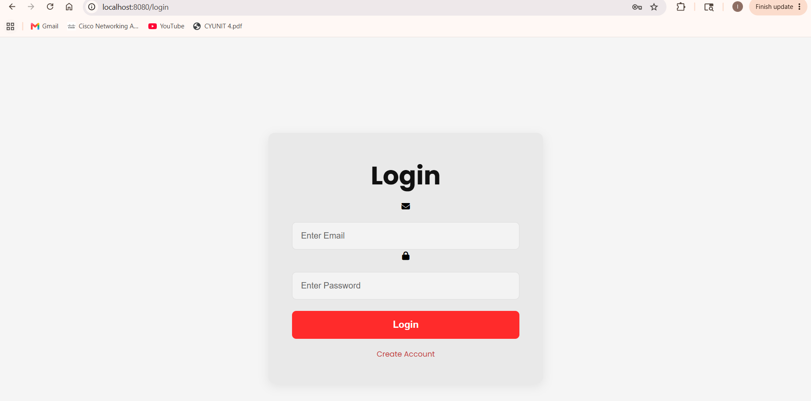
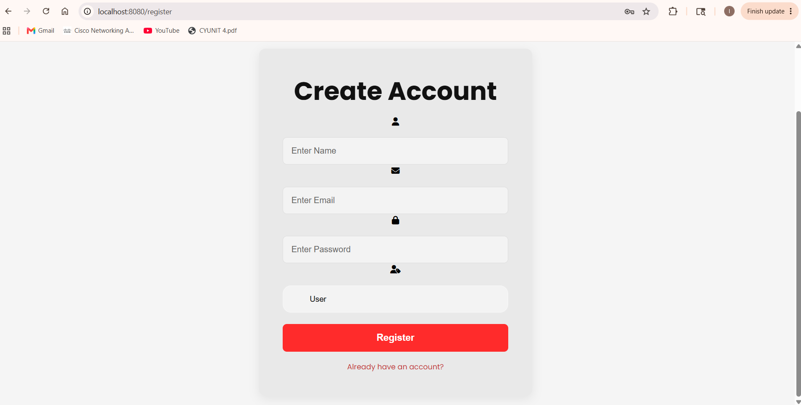
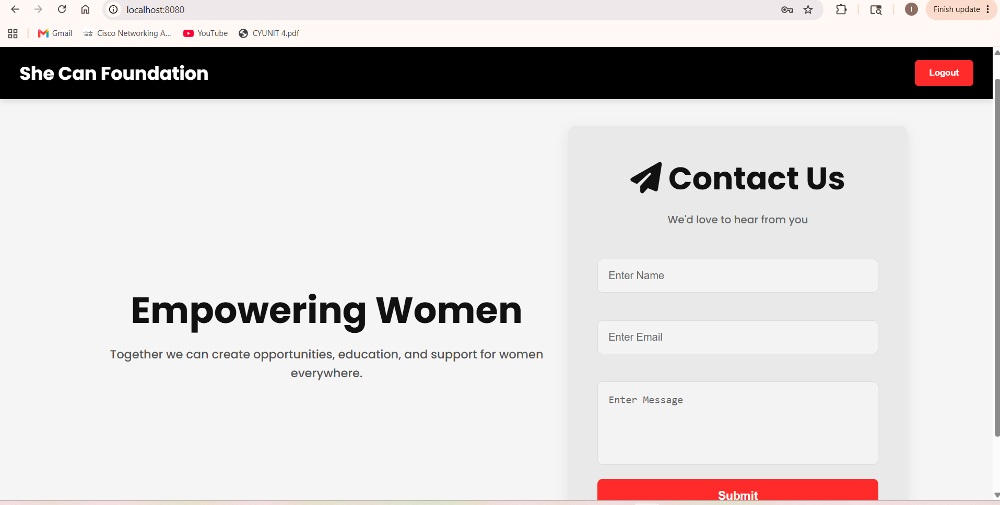
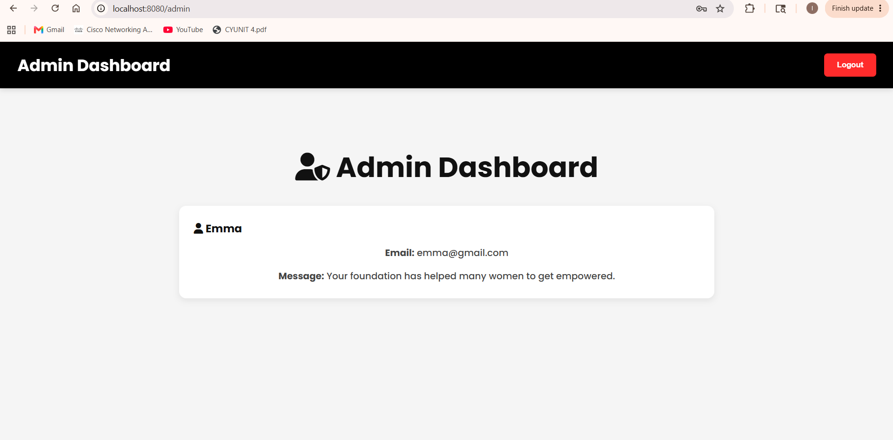

# She Can Foundation – Full Stack Contact Management System

## Overview

This project was developed for the She Can Foundation Full Stack Development Internship Task.

The original task required creating a basic contact form with Name, Email, Message, and Submit functionality. To demonstrate additional full-stack development skills, the project was enhanced with user authentication, role-based access control, cloud database integration, form validation, and an admin dashboard.

---

## Features

### User Features

* User Registration
* User Login
* Role Selection (User/Admin)
* Contact Form Submission
* Client-side Form Validation
* Toast Notifications
* Responsive User Interface

### Admin Features

* Secure Admin Login
* Admin Dashboard
* View All Submitted Contact Messages
* Role-Based Access Control

---

## Tech Stack

### Frontend

* HTML5
* CSS3
* JavaScript

### Backend

* Java
* Spring Boot
* Spring MVC
* Spring Data JPA

### Database

* MySQL (Cloud Hosted)

### Tools

* IntelliJ IDEA
* Git
* GitHub

## Application Screenshots

### Login Page

### Register Page

### Contact Form

### Admin Dashboard

## Project Structure

src
├── main
│   ├── java
│   │   ├── controller
│   │   ├── entity
│   │   ├── repository
│   │   └── service
│   └── resources
│       ├── static
│       └── templates

## How to Run

1. Clone the repository.
2. Open the project in IntelliJ IDEA.
3. Configure the following environment variables:

DB_URL=your_database_url
DB_USERNAME=your_database_username
DB_PASSWORD=your_database_password

4. Run the Spring Boot application.
5. Open:

http://localhost:8080/login

## Future Improvements

* JWT Authentication
* Password Encryption using BCrypt
* Email Notifications
* Search and Filter Messages
* User Profile Management
* Cloud Deployment

## Author

**Isha Bhandari**

Built as part of the She Can Foundation Full Stack Development Internship Task.
